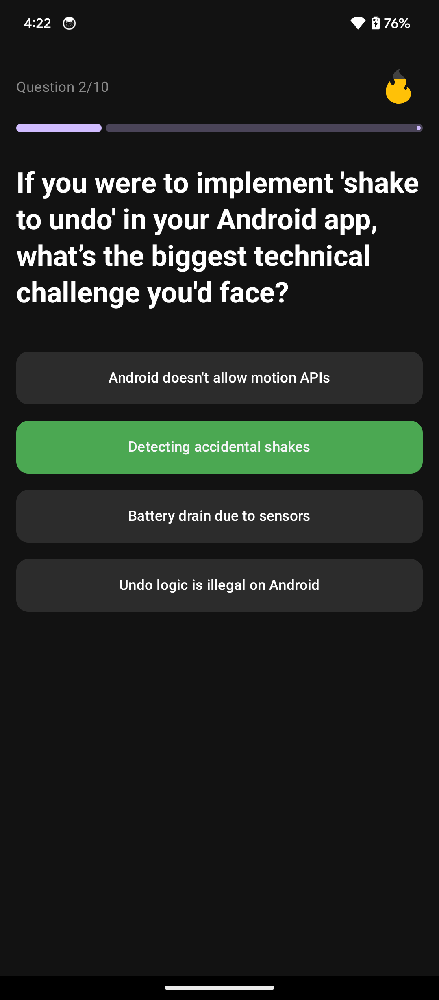

# StreakQuest

StreakQuest is a simple and engaging quiz application built for Android using modern, native development technologies. Test your knowledge, track your score, and see how long of a streak you can maintain!

## Screenshots

| Splash Screen | Quiz Screen | Result Screen |
|:---:|:---:|:---:|
|  |  |  |

## Features

*   **Multiple Choice Questions:** Answer a series of multiple-choice questions.
*   **Score Tracking:** Keep track of your score as you progress through the quiz.
*   **Streak Counter:**  The app tracks your consecutive correct answers.
*   **Clean & Modern UI:** A simple and intuitive user interface built with Jetpack Compose.
*   **Splash Screen:** A welcoming splash screen to greet you when you open the app.
*   **Result Screen:** A summary of your performance, including your final score, total questions, and longest streak.
*   **Navigate between screens:** Seamlessly move between the splash, quiz, and result screens.


## Technologies Used

*   **Kotlin:** The official programming language for Android development.
*   **Jetpack Compose:** Android's modern toolkit for building native UI.
*   **Jetpack Navigation:** For handling in-app navigation.
*   **Hilt:** For dependency injection.
*   **ViewModel:** To store and manage UI-related data.
*   **Material Design:** For a clean and modern user interface.

## Getting Started

To get a local copy up and running, follow these simple steps.

### Prerequisites

*   Android Studio Narwhal or later
*   Android SDK 34

### Installation

1.  Clone the repo
    ```sh
    git clone https://github.com/WaterResistantCoder/StreakQuest.git
    ```
2.  Open the project in Android Studio.
3.  Build and run the project on an emulator or a physical device.
